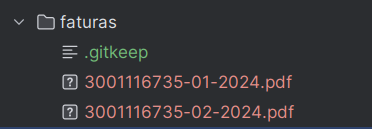
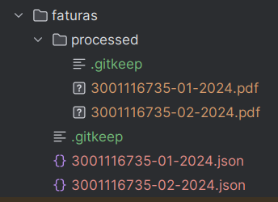

# Boletos API

## Instruções de
- Baixar o projeto: `git clone https://github.com/alepontes/boletos-api.git`
- Instalar dependencias: `npm i`
- Adicione as faturas em `/fatura`
- 

- Ajuste a variavel `invoicesPath` no arquivo `scripts/load-invoices.ts` para o path de `/fatura`
- Complie o projeto: `npm run build`
- Rodar o projeto: `npm run dev`
- Rode o Docker do Postgres `docker compose up -d`
- Rode o comando `npx prisma migrate dev`
- Rode o extrator: `npm run load-invoices`. O resultado deve ser parecido com esse:
- 

- Os arquivos JSON são correspondentes as faturas, o contudo deve ser cadastrado pelo endpoint `POST /invoices`
> Caso use Webstorm, utilize o arquivo `scripts/requests.http`

Após cadastradas, as faturas já estão disponíveis para serem listadas.